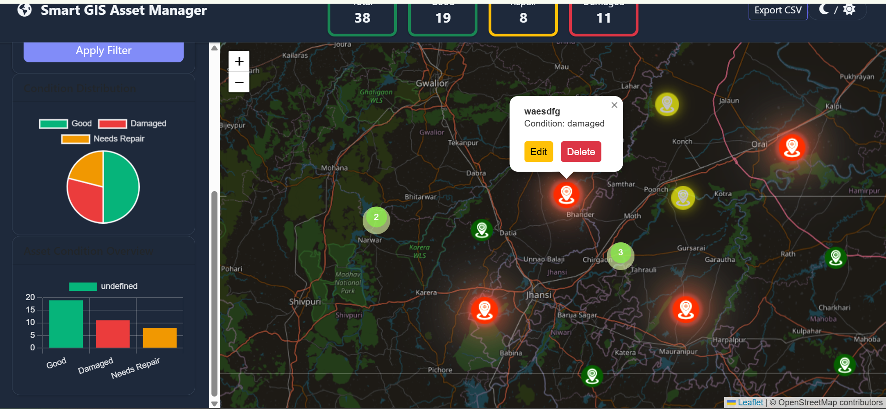
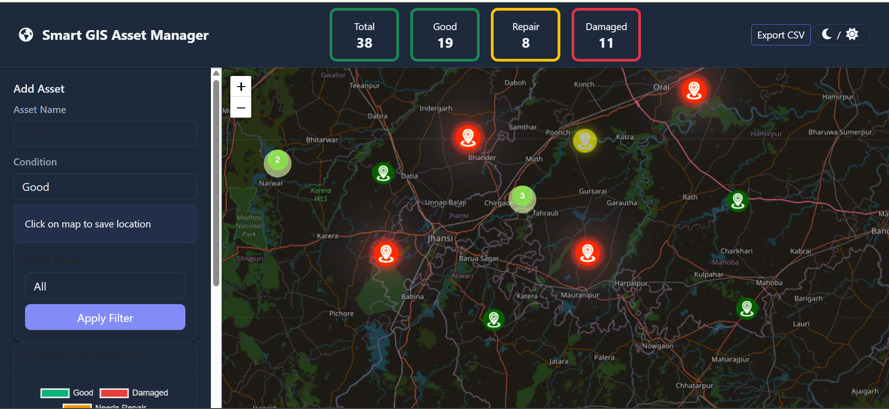
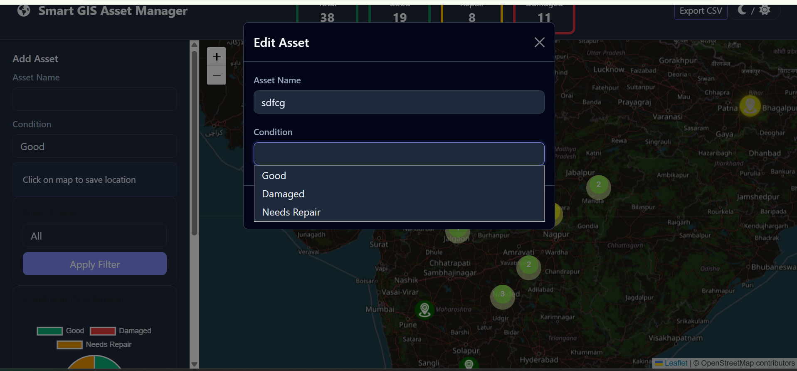

# 🌍 Smart GIS Asset Manager

A web-based GIS asset management system built using **CodeIgniter, PostgreSQL/PostGIS, Leaflet.js, and Chart.js**.  
This application allows users to manage spatial assets, track their condition, and visualize analytics on an interactive map.

---

## ✨ Features

### 📍 GIS Asset Mapping
- Add asset by clicking on map
- Store latitude & longitude in PostGIS
- Interactive Leaflet map visualization

### 🗂 Asset Management
- Add new asset
- Edit asset details
- Delete asset
- Filter assets by condition

### 📊 Analytics Dashboard
- Total asset summary
- Condition distribution charts
- Bar & Pie charts using Chart.js

### 🧭 Smart Visualization
- Marker clustering for performance
- Custom marker icons based on condition
- Animated marker alerts (Damaged / Repair)

### 🕘 Asset History Tracking
- Track condition change history
- View timeline of asset updates

### 🌗 Theme Support
- Dark mode / Light mode toggle
- Chart theme sync with UI

### 📤 Export Functionality
- Export asset data to CSV

---

## 🛠 Tech Stack

| Technology | Usage |
|------------|------------|
| CodeIgniter (PHP) | Backend Framework |
| PostgreSQL + PostGIS | Spatial Database |
| Leaflet.js | Interactive GIS Map |
| Leaflet Marker Cluster | Marker Optimization |
| Chart.js | Analytics Visualization |
| Bootstrap | UI Components |
| JavaScript | Frontend Logic |

---

## 📸 Screenshots

### Dashboard View

### Asset Mapping

### Analytics Charts

---

## 🗄 Database

This project uses **PostgreSQL with PostGIS extension**.

Database schema file is included:

